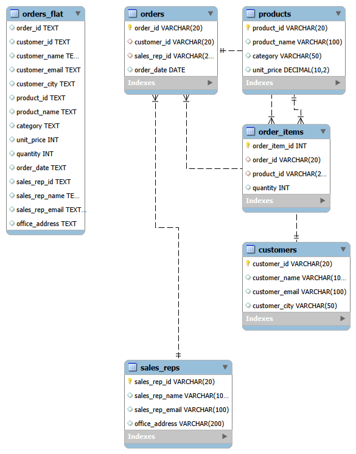

## Anomaly Analysis

## Insert Anomaly
If we want to add new product with basic information but system don't allow to insert it because the table requires order related fields.This shows table prevents storing product data independently. Example-If we want to add Pencil as product_name(Column G) under Stationery category(Column H), we are not able to add it as we don't have order_id (Column A) with subsequent details of customer.
## Update Anomaly
Customer details such customer_email, customer_city which are appearing repeatatively in multiple row because each customer_id with new order_id repeats the same customer information.If Customer changes city, the same value updated in several rows, which leads to inconsistent data.Example-In a table row number 2,5,8,21 & so on have different order id (Column A) with same customer_name (Column C), customer_mail (Column D) & customer_city (Column E), in this case if that customer update his city then that will update across, which leads to inconsistancy.
## Delete Anomaly
If the only order like webcam(product_name-Column G, Row-13) is get deleted, so all information regarding same may also lost.This results loss of important data.
## Normalization Justification
Storing all the information in a single table creates redundancy and increase the risk of anomalies.So the information like customer_city,customer_email repeated for every new order which increase storage unnecessarily and makes update difficult. Normalization resolve this kind of problem by splitting the whole table in to different table and then connect it together with keys. This helps to remove repeatativeness and easy to update the data.
## ER Diagram
